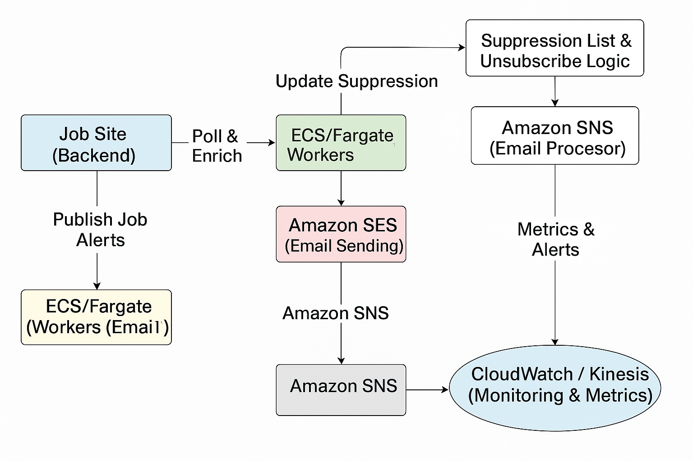
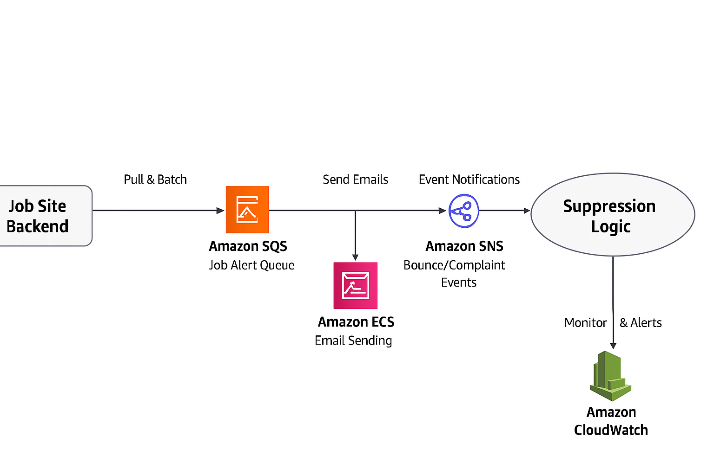

# AWS SES Email Pipeline – Demo Project

This repository demonstrates a **scalable email sending pipeline** built with **Amazon SES, SQS, SNS, and ECS/Fargate**.  
It includes a **Moto-powered local simulation** so you can run and verify the solution **without deploying to AWS** or incurring costs.

---

## 📌 Architecture Overview


**Workflow:**
1. **Job Site Backend** publishes job alert messages to **Amazon SQS**.
2. **ECS/Fargate Workers** process messages in batches, apply rate limiting, and send them via **Amazon SES**.
3. **Amazon SNS** captures bounces and complaints, feeding them into suppression list logic.
4. **CloudWatch/Kinesis** monitors deliverability metrics and triggers alerts for anomalies.
5. **Terraform** provisions the entire pipeline as code for reproducibility.

---

## ✨ Key Features

- **Massively Scalable:** Designed to handle millions of monthly job alert emails.
- **Deliverability Best Practices:** SPF, DKIM, DMARC setup and IP warm-up ready.
- **Monitoring & Observability:** Event destinations for bounces/complaints + CloudWatch metrics.
- **Fully Automated IaC:** Infrastructure defined using Terraform for one-click deployment.
- **Cost-Free Testing:** Local simulation with [Moto](https://github.com/getmoto/moto).

---

## 📌 Architecture Overview

### High-Level Workflow


### Detailed Pipeline


The first diagram gives a top-level overview of the flow, and the second provides detailed architecture for developers and DevOps engineers.

---


## 🗂 Project Structure

aws-ses-email-pipeline/
│
├── README.md
├── diagrams/
│ └── aws_ses_email_architecture.png # Architecture diagram
├── terraform/
│ ├── main.tf # SQS, SES, SNS infrastructure as code
│ ├── variables.tf
│ └── outputs.tf
└── worker/
├── email_worker.py # Worker script to pull messages and send emails
└── simulate_local.py # Local simulation using Moto


---

## ⚡ Quick Start (Local Simulation)

You can run the entire pipeline **locally** with no AWS resources. Perfect for demos and development.

### 1. Install Dependencies
```powershell
py -m pip install boto3 moto


2. Run the Simulation
cd worker
py simulate_local.py


3. Expected Output
Running local simulation (Moto)…
[OK] Simulated send to ['user@example.com'] | subject='Test Job Alert'
Simulation complete ✅


Author

Amin Jafar Syed
Senior Engineering Lead | Cloud & DevSecOps | AWS SES & Terraform Specialist